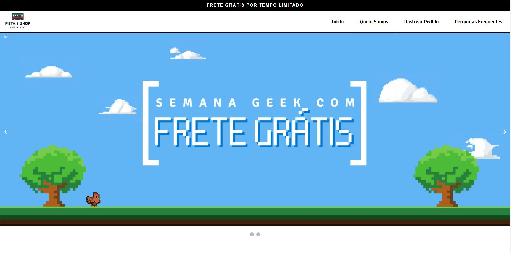

<h1 align="center"> Pieta E-Shop </h1>

Um site de vendas desenvolvido como forma de prova para a disciplina de Desenvolvimento WEB do IFC Blumenau.  

  <a href="#-tecnologias">Tecnologias</a>&nbsp;&nbsp;&nbsp;|&nbsp;&nbsp;&nbsp;
  <a href="#-projeto">Projeto</a>&nbsp;&nbsp;&nbsp;|&nbsp;&nbsp;&nbsp;
  <a href="#-layout">Layout</a>&nbsp;&nbsp;&nbsp;|&nbsp;&nbsp;&nbsp;
  <a href="#memo-licença">Licença</a>

  

 

  

## 🚀 Tecnologias

Esse projeto foi desenvolvido com as seguintes tecnologias:

- HTML e CSS
- JavaScript
- VueJS
- Git e Github

## 💻 Projeto

O Pieta-E shop é um site de vendas de produtos eletronicos.

- [Visite o projeto online](https://matheuspieta.github.io/Prova_Desenvolvimento_WEB/)

## :memo: Licença

Esse projeto está sob a licença MIT.

---

Created By Matheus Pieta e Crislaine Tatiane Timm
